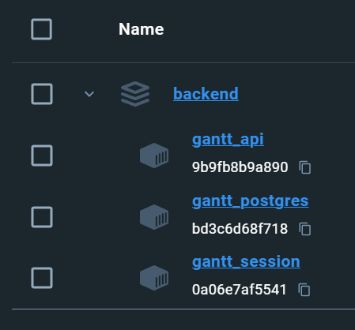

# オンデマンド化

## 概要

オンデマンド化に向けて必要な作業と、提供するまでの手順を記載する。

## やること

1. docker image のファイル化
2. docker image のファイルから読み込み
3. 読み込んだイメージからサービスの起動を試みる
4. フロントの新たなdocker-image化

## 1. docker image のファイル化

どうやらローカルで作成したイメージを tar に保存できる模様
https://qiita.com/loftkun/items/2238cc238dd9c55b7514

```
sudo docker save [imageの列の名前を指定する] > image.tar
```

docker image から確認する（docker-compose.yaml の nameからでも docker images からでも確認できる）


```shell
docker save backend-gantt_api > gantt_api.tar
docker save backend-gantt_postgres > gantt_postgres.tar
docker save backend-gantt_session > gantt_session.tar
docker save backend-gantt_migration > gantt_migration.tar
docker save backend-gantt_web > gantt_web.tar
```

// TODO: フロントのimagesも追加する

## 2. docker image のファイルから読み込み

ここで一旦docker-imageは全部消した。（名前重複とかめんどくさそうだったから）

```shell
docker load < gantt_api.tar
docker load < gantt_postgres.tar
docker load < gantt_session.tar
docker load < gantt_migration.tar
docker load < gantt_web.tar
```

余計なバージョンも含まれているけど一旦復元は完了した模様。

そしてこのイメージを指定してdocker-compose.yamlからアプリケーション起動をする

## 3. アプリケーションの起動

.envとdocker-compose.yamlをコピー

docker-compose.yamlについては db の保存先を書き換える（あとepsonとかついちゃうからイメージ名もちゃんと書き換えるようにすること）

事前にDBのテーブルは全部削除しないとだめかも？
→そんなことなかった。

```shell
docker volume create so-link_dbdata_gantt
docker-compose up gantt_postgres -d
docker-compose up gantt_session -d
docker-compose run --rm migration
docker-compose up gantt_api -d
docker-compose up gantt_web -d
```


## 課題

- ローカル化は成功してるけど docker image に入られるとgoのソースが全部丸見えになっている？
  - exeだけのbuildをさせる必要がありそう。もしくはexeは作られているからソースコードを後で全部消しちゃえばよさそう。
  - というかexeだけの状態にしないとダウンロードはいっちゃう？
  - complile daemonで動かしてるから違うdockerfileでイメージビルドしてソースコードを削除してあげればOK？
- フロントのURL指定の仕方がわからない
  - 現状では.envファイルで指定されているものが利用されるが、build時点で固定されてしまう。
- APIサーバーのポートは80にするべき
  - 今はapiサーバーが80を占領してしまっている
- buildするときはapiのDockerファイル指定をDockerFileForProvisionに変更する
- フロントのbuildはAPIへのURLを変更してビルドしてdockerフォルダに置きなおす
- パラメータ周りを整理する

技術的な課題は一旦クリアしたので正直に現状を伝えつつ資料を作って打ち合わせに向かう。

さて何で作るか。
googleのwordで作るか。

## 残作業
- 時限装置の作成（golang側で固定値で持たせる。フロント側でも表示させる） envとかではなくハードコーディングでやることになる。管理に注意。